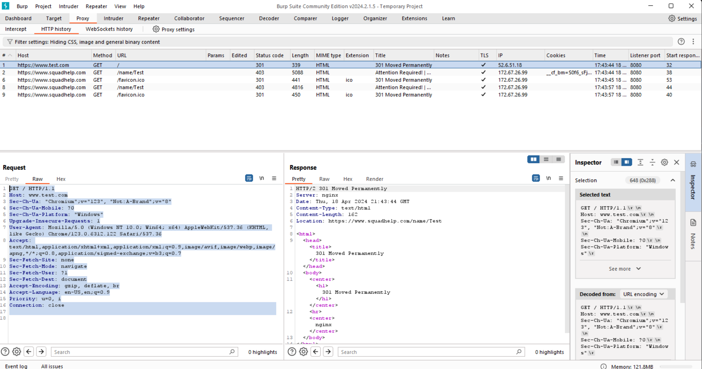

# Pyintruder
This is a command-line tool I built for myself as a substitute for Portswigger's intruder tool, which I didn't want to pay for. The tool itself is my own code and is open source.

## Installation
this can be installed via pip. 
```bash
pip3 install git+https://github.com/Lukerd-29-00/pyintruder
```
The package is not on PyPi, thus the git+ prefix is necessary. Once you have installed it, you may access the command line tool with the command 
```bash
python3 -m pyintruder
```
You can also import pyintruder into a python script the same way you would import any other module.
## Usage
This tool is designed to be used along side Portswigger's <a href="https://portswigger.net/burp/communitydownload">Burp Suite</a> tool for web vulnerability testing. If you're familiar with the intruder tool, this tool's usage is very similar. It takes a file containing the full text of an HTTP request, with a few variables that are substituted from keywords in a dictionary file. By default, it will print out the substiuted values at the end along with the status code from the server when the request was sent.

### getting more response information
If you need more information than the status code, you will need to write your own python program and import pyintruder as a module instead of using the command line. you can supply a callback to the IntruderSession.intrude_pitchfork method that processes the response from the server, which will supply the output of the function.

### Positional Parameters
This tool takes two positional arguments; the template file followed by the host being contacted.

#### Template-file
This file should contain the raw text of an HTTP request. You can obtain this easily by examining the request in burp suite, and then copying it into a text file. The tool will interpret this as a python format string. This means you can substitute values by putting them in curly braces ('{' and '}'). If you need to use literal curly braces, you simply type double brackets '{{' and '}}'. Make sure you don't leave curly brackets that need to be escaped this way accidentally. Here's an example:


This allows you to substitute the variable 'verb' for HTTP verbs. See the dictionaries option to map these variables to a list of values to substitute them for.

#### host
This is the server you are targeting. This should just be the <i>server</i>. There should be no path or query parameters. If the page you want is www.foo.com/page.html, you should <i>not</i> enter https://www.foo.com/page.html, but <i>only</i> https://www.foo.com. The path is included in the HTTP template file so that you can add parameters like anywhere else in the request.

### Options:
This tool has several switches and options. All of these are optional except the dictionaries argument.

#### dictionaries
This option (indicated by -d or --dictionaries) maps variables in the template file (see above) to dictionary files. It uses the format variable,file. The file can be either a relative or absolute path to a file. The file should be a list of strings that are substituted into the request, one per line. 

##### default dictionaries
This tool comes with a few default wordlists. You can list these dictionaries with the -l or --ls switch (see below). To use these, you can simply type the file name of one of the dictionaries instead of a path to a file. You can use a file that has the same name as one of the default dictionaries by starting the file name with './' (or .\\ on windows).

##### multipile occurrences
The dictionaries option can occur several times, to allow you to substitute multipile variables with different wordlists. This will behave like Burp Suite's pitchfork attack; it will move through the lists in lockstep. For example, if list 1 has a,b and list 2 has b,a you will send two requests with values (a, b) and (b, a). If you use several dictionaries, they must have exactly the same number of values, otherwise an error will occur.

#### help
The -h or --help switch will display a brief summary of the usage as a reminder if you forget the syntax.

#### ls
The -l or --ls switch will display the files included in the pyintruder library itself (see default dictionaries above). No other parameters should be listed if this switch is used.

#### verbose
This switch tells the tool to log requests as they happen, allowing you to see that the tool is making progress. It also displays the URL, which can be useful for debugging.

#### no-ssl
The -s or --no-ssl switch indicates that the library should continue if the certificate is invalid (e.g. a self-signed certificate)

#### batch size
the -b or --batch-size switch is the number of requests that are sent out at once (the requests are handled asynchronously). The default value is 10. The higher the number, the faster the attack completes. However, too high a batch size may trigger rate limiting issues or overwhelm the server if you aren't careful.

### Example usage
Here is a sample of using the tool. First, we copy the raw text of a request from burp into a file.




Then we replace some part of the request (in this case the method) with a template string:


Now we enter the command:
```bash
python3 -m pyintruder -d verb,HTTP_verbs.txt template.txt https://www.google.com
```

and get this output:


And now we can see that https://www.google.com/ only accepts the GET and HEAD methods.
